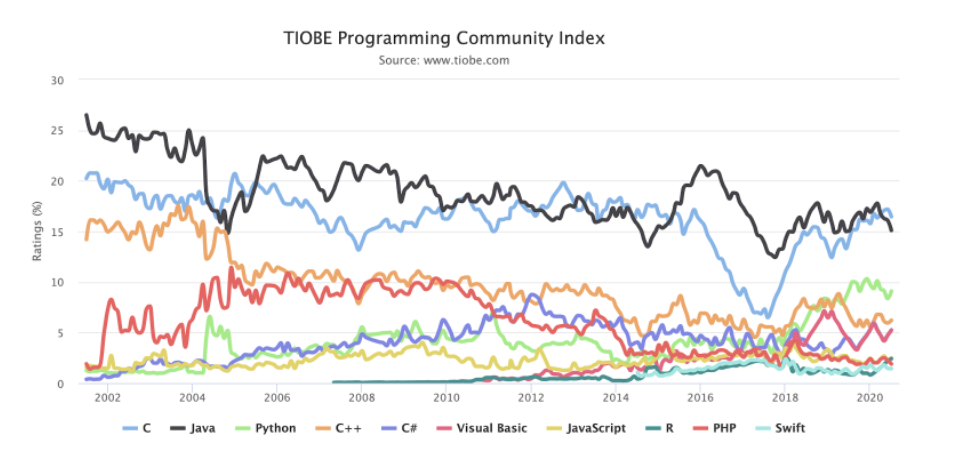
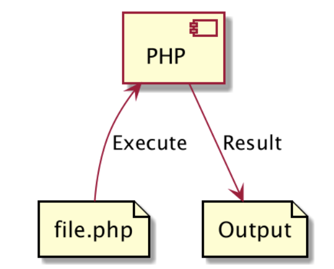

# Pengenalan PHP

- PHP singkatan dari PHP : Hypertext Preprocessor
- PHP banyak digunakan sebagai bahasa pemrograman yang dikhususkan untuk web development
- PHP sangat mudah digunakan dan banyak sekali diadopsi oleh programmer web
- Bahkan hampir mayoritas kebanyakan web di dunia dibuat menggunakan PHP
- PHP pertama kali dibuat oleh Rasmus Lerdorf pada tahun 1995

# Open Source

- PHP adalah bahasa pemrograman yang opensource
- Kita bisa download PHP di website php.net
- Atau bisa liat source code nya di halaman github php https://github.com/php/php-src
- Selain open source, PHP juga free untuk digunakan, sehingga tidak ada biaya yang harus kita keluarkan untuk
  menggunakan PHP

# Kenapa Belajar PHP

# Proses Development PHP

# Apa yang Bisa Dibuat Menggunakan PHP?

- Server-side scripting. Ini adalah salah satu fokus utama web, untuk membuat aplikasi server side. Biasanya digunakan
  sebagai aplikasi web menggunakan bantuan web server, dan kita bisa melihat output aplikasi menggunakan web browser (
  Internet Explorer, Chrome, Firefox, dan lain-lain)
- Command line scripting. PHP juga bisa digunakan untuk membuat program berbasis command line, tanpa harus menggunakan
  web server
- Desktop application, walaupun jarang digunakan, tapi PHP juga bisa digunakan untuk membuat aplikasi desktop
  menggunakan PHP-GTK 

